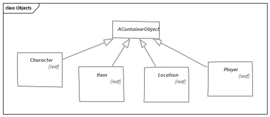

# How to use Heretic.InteractiveFiction

## Sample Adventure
A manageable but constantly growing text adventure that illustrates the functionalities of Heretic.InteractiveFiction can be found [_here_](https://github.com/biegomar/Heretic.InteractiveFiction/tree/main/samples/Heretic.InteractiveFiction.LogCabin). This documentation often refers to this sample.

## 1. Setup a new console project

```shell
dotnet new console HereticExample
```

```shell
dotnet add package Heretic.InteractiveFiction
```

## 2. Resource files at the heart of your game
Heretic relies on resource files for all of its texts to provide a simple technical option for multi-language support. You should also take this approach. By convention, there should be at least one resource file where you maintain your messages and descriptions. This file should be named _**Descriptions.resx**_. Of course you can name the file whatever you like, or add and use any other resource files you want!  
Furthermore, the framework offers support for four special resource files, in which the names, or identifiers of the various items, characters, locations and conversations of the game are stored. These are:
* Locations
* Items
* Characters
* Conversations

But what's so special about these resource files? Well, it makes sense to provide an item not only with one caption, but to offer more options (e.g. bookshelf, shelf, rack) to make it more convenient for the player.  
This is achieved by the fact that the values of the resources are a number of words separated from each other by the pipe (|). This method gives you an easy way to store multiple names.  

Example:  


### 2.1 The IResourceProvider interface
But to make the listed names usable in your adventure, there is the IResourceProvider interface, that you have to implement in your game. It comes as no surprise that the interface provides four methods that have to be implemented:

```csharp
IDictionary<string, IEnumerable<string>> GetConversationsAnswersFromResources();
IDictionary<string, IEnumerable<string>> GetItemsFromResources();
IDictionary<string, IEnumerable<string>> GetCharactersFromResources();
IDictionary<string, IEnumerable<string>> GetLocationsFromResources();
```
To keep it simple at the beginning, the class is defined only as follows:
```csharp
internal class ResourceProvider: IResourceProvider { }
```
The default implementation of the interface is then used here, which does not yet evaluate pipes. But we will come back to this later.

## 3. Ramp up your console printing
Heretic provides a simple way to print text to the console. You can use the abstract class and extend it to create your own print methods. Or you can implement your own class based on the underlying interface IPrintingSubsystem. But using the abstract class is easier in the beginning.  
Four methods must be overwritten from the base class and provided with their own texts:

```csharp
internal sealed class ConsolePrinting: BaseConsolePrintingSubsystem
{
    public override bool Opening()
    {
        Console.WriteLine(Descriptions.OPENING);

        return true;
    }

    public override bool Closing()
    {
        Console.WriteLine(Descriptions.CLOSING);
        
        return true;
    }

    public override bool TitleAndScore(int score, int maxScore)
    {
        Console.Title = $"{string.Format(BaseDescriptions.SCORE, score, maxScore)}";
        return true;
    }

    public override bool Credits()
    {
        Console.WriteLine(Descriptions.CREDITS);
        
        return true;
    }
}
```
### Tip: always use Resource files for your messages

As you can see in the example above, the resource files have already been used for the individual texts. You should always remember to organize all texts via the resource files.

## 4. Create _your_ adventure
Now you and your creativity is needed. Through the interface ```IGamePrerequisitesAssembler``` you implement your world, its places, objects, characters and their individual behavior.

```csharp
internal sealed class GamePrerequisitesAssembler: IGamePrerequisitesAssembler
{
    public GamePrerequisites AssembleGame()
    {
        var livingRoom = GetLivingRoom();
        
        var map = new LocationMap(new LocationComparer());

        var activeLocation = livingRoom;
        var activePlayer = GetPlayer();
        var actualQuests = GetQuests();
        
        return new GamePrerequisites(map, activeLocation, activePlayer, null, actualQuests);
    }

    private static Location GetLivingRoom()
    {
        var livingRoom = new Location()
        {
            Key = Keys.LIVINGROOM,
            Name = Locations.LIVINGROOM,
            Description = Descriptions.LIVINGROOM
        };

        return livingRoom;
    }

    private static Player GetPlayer()
    {
        var player = new Player()
        {
            Key = Keys.PLAYER,
            Name = "",
            Description = Descriptions.PLAYER,
        };

        return player;
    }
    
    private static ICollection<string> GetQuests()
    {
        var result = new List<string>
        {
            Descriptions.QUEST_I
        };

        return result;
    }
}
```

### 4.1 Keys
Every object in your world has a unique, text-based key. You should maintain these keys in a central place - e.g. the Keys file.

```csharp
internal static class Keys
{
    internal static string LIVINGROOM = "LIVINGROOM";
    internal static string PLAYER = "PLAYER";
}
```

### 4.2 The class hierarchy

