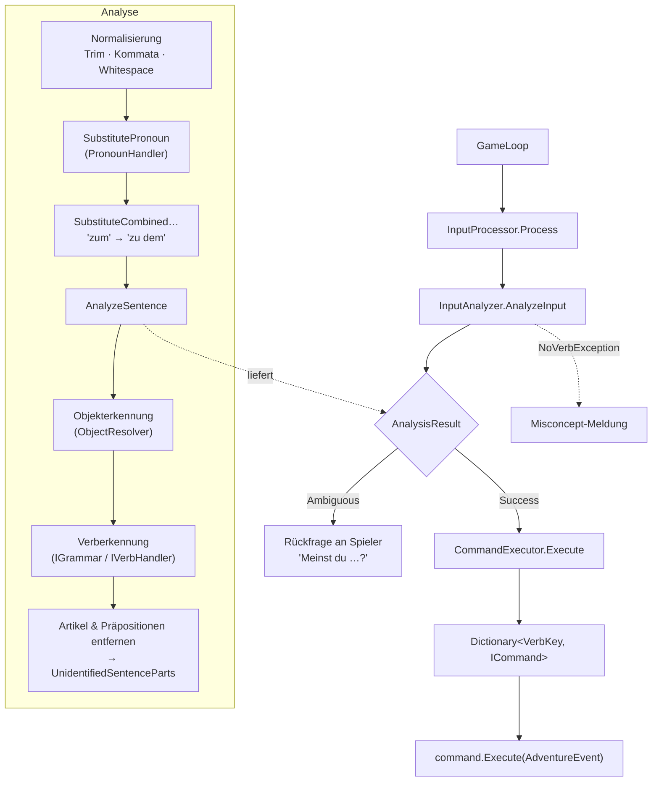
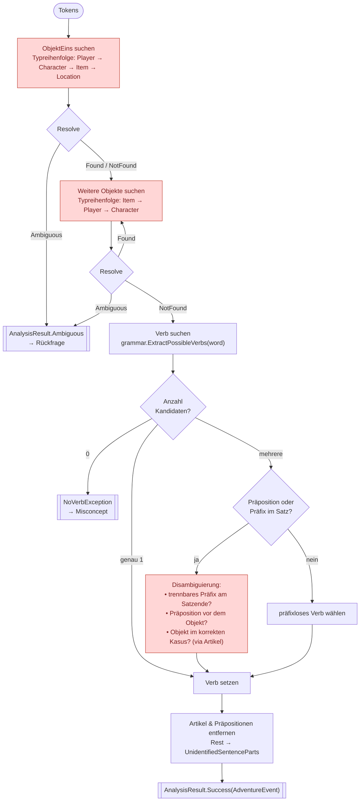

# Parser-Architektur — Analyse, Stärken & Schwächen

> Stand: 2026-06-28 · Branch `feature/better_parser`
> Diese Dokumentation beschreibt den aktuellen Text-Parser, bewertet ihn und dient
> als Grundlage für eine verbesserte Version.

---

## 1. Überblick: Die Pipeline

Der Parser wandelt einen eingegebenen Satz (z. B. *„Lege das Buch auf den Tisch"*)
in ein `AdventureEvent` um, das ein Verb (`Predicate`) und bis zu zwei aufgelöste
Spielobjekte trägt. Dieses Event wird anschließend an das passende `ICommand`
weitergereicht.

```
GameLoop
  └─ InputProcessor.Process(input)
       ├─ InputAnalyzer.AnalyzeInput(input)   → AnalysisResult (Success | Ambiguous)
       │    ├─ Normalisierung (Trim, Kommata, Whitespace)
       │    ├─ SubstitutePronoun            (PronounHandler)
       │    ├─ SubstituteCombinedPrepositionsAndArticles  ("zum" → "zu dem")
       │    └─ AnalyzeSentence
       │         ├─ Objekterkennung Obj1   (ObjectResolver → Universe-Ressourcen)
       │         ├─ Objekterkennung Obj2…N (Schleife)
       │         ├─ Verberkennung          (IGrammar / IVerbHandler)
       │         ├─ Artikel entfernen
       │         └─ Präpositionen entfernen → UnidentifiedSentenceParts
       └─ CommandExecutor.Execute(adventureEvent)
            └─ Dictionary<VerbKey, ICommand> → command.Execute(event)
```

Dieselbe Pipeline als Diagramm:



### Beteiligte Typen

| Typ | Rolle |
|-----|-------|
| `InputProcessor` | Orchestriert: Analyse → Ausführung → periodische Events → Score/Win-Check. Fängt `NoVerbException` / `AmbiguousHereticObjectException`. |
| `InputAnalyzer` | Das eigentliche Parsing-Herzstück. Tokenisiert, ersetzt Pronomen, erkennt Objekte und Verb, räumt Füllwörter weg. |
| `ObjectResolver` | Löst einen Wort-Token gegen die Spielwelt auf (`ResolveResult.Found/NotFound/Ambiguous`). Kapselt Prioritätsregeln (aktives Objekt → lokale Items → globale Ressourcen). |
| `ObjectHandler` | Öffentliche Fassade über `ObjectResolver` + `ActiveObjectTracker` + `WorldMutator` (für Spielautoren / Commands). |
| `IGrammar` / `GermanGrammar` | Sprachschicht: Präpositionen, kombinierte Präposition+Artikel ("im", "zum"), Verbextraktion. |
| `IVerbHandler` / `GermanVerbHandler` | Lädt Verben aus `.resx`, liefert Kandidaten-Verben zu einem Wort (inkl. ortsspezifischer `OptionalVerbs`). |
| `Verb` / `VerbVariant` / `PrepositionVariant` | Datenmodell: ein Verb hat mehrere Schreibvarianten (mit optionalem trennbarem Präfix) und erlaubte Präpositionen mit Kasus. |
| `AdventureEvent` | Ergebnis-DTO: `Predicate`, `AllObjects` (→ `ObjectOne`/`ObjectTwo`), `UnidentifiedSentenceParts`. |
| `AnalysisResult` | Discriminated Union: `Success(AdventureEvent)` oder `Ambiguous(Candidates)`. |

---

## 2. Ablauf im Detail

### 2.1 Normalisierung (`AnalyzeInput`)
```csharp
var normalizedInput = input.Trim().Replace(", ", ",").Replace(",", " ");
var sentence = normalizedInput.Split(' ').Where(x => !IsNullOrWhiteSpace(x));
sentence = SubstitutePronoun(sentence);
sentence = SubstituteCombinedPrepositionsAndArticles(sentence);
```
- Kommata werden zu Worttrennern (Listen wie *„nimm Buch, Lampe"*).
- **Pronomen-Auflösung:** „es/ihn/…“ wird durch den Namen des zuletzt aktiven
  Objekts (`Universe.ActiveObject`) ersetzt.
- **Verschmelzungen:** „zum“ → „zu dem“, „ins“ → „in das“ usw. via Ressource.

### 2.2 Objekterkennung (`AnalyzeSentence`)
Die Erkennung erfolgt **typpriorisiert** und **wortweise**:

1. **ObjektEins** wird gesucht, indem nacheinander versucht wird, *irgendeines*
   der Wörter als `Player` → `Character` → `Item` → `Location` aufzulösen.
2. Danach werden in einer Schleife **weitere Objekte** gesucht (`Item` →
   `Player` → `Character`). Das zweite gefundene wird `ObjectTwo`; alle landen in
   `AllObjects`.
3. Jedes erkannte Objekt wird aus der Token-Liste entfernt; ebenso seine
   Adjektive (`AdjectiveDeclinationHandler.RemoveAdjectivesFromParts`).

`ObjectResolver.Resolve<T>` liefert dabei drei Zustände zurück:
`Found`, `NotFound`, `Ambiguous` (z. B. „nimm Schlüssel“, wenn es zwei Schlüssel
gibt). Bei `Ambiguous` bricht der Analyzer ab und `InputProcessor` stellt eine
Rückfrage („Meinst du den roten oder den blauen Schlüssel?“).

**Prioritätslogik bei Items** (`ObjectResolver`):
`GetFirstPriorityKeyByName` (aktives Objekt / Pronomen) → `GetSecondPriority…`
(Items in aktueller Location + Inventar, rekursiv inkl. Container & `LinkedTo`) →
globale Ressourcen.

### 2.3 Verberkennung (`GetVerbAndRemoveFromParts`)
Das ist der komplexeste Teil. Grobablauf je verbleibendem Wort:

- `grammar.ExtractPossibleVerbs(word)` liefert Kandidaten (ein Wort kann mehrere
  Verben treffen, z. B. „schließe“ → CLOSE *oder* LOCK über „schließe ab/zu").
- **Genau ein Kandidat** → direkt setzen.
- **Mehrere Kandidaten + Präposition/Präfix im Satz** → Disambiguierung über:
  - trennbares Präfix am Satzende? (`IsPrefixTheLastWordInSentence`)
  - passende Präposition *vor* dem Objekt? (`IsPrepositionInFrontOfObject`)
  - Objekt im korrekten Kasus zur Präposition? (`IsObjectInCorrectCaseForPreposition`,
    geprüft über den Artikel im Satz)
- **Mehrere Kandidaten, keine Präp./Präfix** → das präfixlose Verb wählen.
- Kein Verb gefunden → `NoVerbException`.

Anschließend werden Verbpräfixe, Artikel und Präpositionen aus den Tokens
entfernt; der Rest wird zu `UnidentifiedSentenceParts`.

Der Entscheidungsfluss innerhalb von `AnalyzeSentence` (Objekt- + Verberkennung):



> Die rot markierten Pfade (Typreihenfolge statt Kasus, heuristische
> Verb-Disambiguierung) sind genau die in Abschnitt 5 beschriebenen Schwächen.

### 2.4 Dispatch (`CommandExecutor.Execute`)
```csharp
if (adventureEvent.Predicate != null &&
    commands.TryGetValue(adventureEvent.Predicate.Key, out var command))
    return command.Execute(adventureEvent);
return false;   // → Misconcept-Meldung
```

---

## 3. Datenmodell der Sprache

Verben werden aus `Resources/Verbs.resx` geladen, Format pro Eintrag:
```
DROP = Leg:hin|Lege:hin|Legen:hin|Leg:ab|verliere|Drop|fallen:lassen|Ablegen
        └── Name:Präfix  (Präfix = trennbares Verbpräfix, optional)
```
Präpositionen je Verb in `VerbsAndPrepositions.resx`:
```
DROP = in:ACCUSATIVE          (Präposition:Kasus)
```
Umlaut-Varianten werden beim Laden automatisch erzeugt (ä→ae …), sodass
„schliesse“ und „schließe“ beide greifen.

---

## 4. Stärken

1. **Klare, moderne Trennung der Verantwortlichkeiten.** Die jüngste
   Refaktorierung (Aufspaltung des alten `ObjectHandler` in `ObjectResolver` +
   `ActiveObjectTracker` + `WorldMutator`) ist sauber. `InputAnalyzer` parst,
   `ObjectResolver` löst auf, `CommandExecutor` führt aus.
2. **Discriminated Unions statt Sonderwerte.** `AnalysisResult` und
   `ResolveResult<T>` als versiegelte Records sind typsicher und gut lesbar —
   Ambiguität wird als eigener Zustand modelliert, nicht über `null`/Exceptions
   im Normalfall.
3. **Echte deutsche Grammatik.** Trennbare Verbpräfixe, Kasus-Prüfung über
   Artikel, Präposition-Artikel-Verschmelzungen („im“, „zum“), Adjektiv-
   deklination, Umlaut-Normalisierung — das ist für ein Hobby-IF-Framework
   bemerkenswert weit.
4. **Sprache ist abstrahiert.** `IGrammar` / `IVerbHandler` / `IResourceProvider`
   erlauben prinzipiell andere Sprachen, ohne den `InputAnalyzer` zu ändern.
5. **Kontextsensitive Auflösung.** Prioritäten (aktives Objekt → lokale Szene →
   global) und Pronomen-Auflösung machen die Eingabe natürlich
   („nimm das Buch“ … „lies es“).
6. **Erweiterbar pro Ort.** `OptionalVerbs` je Location erlauben szenenspezifische
   Verben ohne globale Registrierung.

---

## 5. Schwächen

### 5.1 Architektur / Design
- **Keine echte Grammatik-/Satzstruktur.** Der Parser kennt keine Wortreihenfolge
  und keine Phrasenstruktur. Er sammelt „irgendwo im Satz ein Objekt, irgendwo ein
  Verb“. Reihenfolge wird nur punktuell über `IndexOf` rekonstruiert
  (`IsPrepositionInFrontOfObject`). Das macht „Gib dem Drachen das Schwert“ vs.
  „Gib das Schwert dem Drachen“ schwer unterscheidbar — die Zuordnung
  Obj1/Obj2 hängt an Erkennungs-*Reihenfolge der Typen*, nicht an Satzrollen.
- **Verb-Disambiguierung ist verschachtelte Heuristik.** `GetVerbAndRemoveFromParts`
  ist ~120 Zeilen mit fünffacher Verschachtelung und Booleschen Kombinationen
  (`isPrefixOnly`/`isPrepositionOnly`/`isPrefixAndPreposition`). Schwer testbar,
  schwer erweiterbar, fehleranfällig bei neuen Verbmustern.
- **Reihenfolgeabhängige Typprioritäten als Geschäftslogik.** Dass Obj1 zuerst als
  Player/Character/Item/Location probiert wird und Obj2 als Item/Player/Character,
  ist eine implizite Annahme, die nirgends als Regel formuliert ist.
- **Kasus-Prüfung nur über Artikel.** `IsObjectInCorrectCaseForPreposition` erkennt
  den Kasus daran, ob der passende Artikel im Satz steht. Ohne Artikel
  („leg Buch auf Tisch“) oder bei artikellosen/abgekürzten Eingaben greift die
  Logik nicht zuverlässig (es gibt bereits einen `isNoArticlePresent`-Fallback,
  der die Prüfung quasi überspringt).

### 5.2 Funktionalität
- **Maximal zwei Objekte wirklich nutzbar.** `AllObjects` sammelt zwar mehr, aber
  `AdventureEvent` exponiert nur `ObjectOne`/`ObjectTwo`. „Nimm alles“ /
  Multi-Objekt-Befehle sind nicht erstklassig modelliert.
- **Keine Mehrdeutigkeit beim Verb.** Ambiguität gibt es nur für Objekte. Bleibt
  das Verb mehrdeutig, wird hart eine Variante gewählt statt nachzufragen.
- **„Misconcept“ ist die einzige Fehlerrückmeldung** bei nicht ausführbaren, aber
  grammatisch erkannten Sätzen. Es gibt keine differenzierte Diagnose
  („Objekt nicht hier“, „Verb kennt diese Präposition nicht“, „du siehst kein X“).
- **Stilles Verwerfen von `UnidentifiedSentenceParts`.** Übrig gebliebene Wörter
  werden gesammelt, aber kaum genutzt — Tippfehler/Unbekanntes verschwindet
  geräuschlos statt eine hilfreiche Meldung zu erzeugen.

### 5.3 Robustheit / Performance
- **Wiederholte lineare Scans über die ganze Welt.** Pro Eingabewort wird über
  alle Item-/Character-/Location-Ressourcen iteriert, teils rekursiv und mehrfach
  pro Satz. Für kleine Spiele unkritisch, aber O(Wörter × Weltgröße).
- **Kein Tokenizer-Schutz.** Splitting per `Replace`/`Split(' ')`; mehrfache
  Satzzeichen, Bindestriche, Zahlwörter („das dritte Buch“) sind nicht abgedeckt.
- **`Resolve` nutzt Exceptions im Kontrollfluss** (`AmbiguousHereticObjectException`
  wird gefangen und in `ResolveResult.Ambiguous` übersetzt) — funktioniert, ist
  aber ein Mischstil zwischen Exception-Flow und Result-Pattern.

### 5.4 Testbarkeit
- **Kaum direkte Parser-Tests.** Es existiert nur `ObjectHandlerTest`
  (aktives Objekt). Es gibt keine Tabellen-/Theory-Tests, die Sätze → erwartetes
  `AdventureEvent` abdecken. Gerade die Verbheuristik bräuchte das dringend.

---

## 6. Ideen für die verbesserte Version (Diskussionsgrundlage)

Mögliche Richtungen — bewusst noch ohne Festlegung:

1. **Explizite Token-/Pipeline-Stufen.** Tokenize → Normalize → Tag (Verb /
   Substantiv / Artikel / Präposition / Adjektiv / Pronomen) → Parse (Rollen
   zuordnen) → Resolve → Build `AdventureEvent`. Jede Stufe einzeln testbar.
2. **Pattern-/Grammatik-Tabelle pro Verb** statt verschachtelter `if`s. Z. B.
   deklarativ: `DROP: <obj:akk> [ "in"|"auf" <obj2:akk/dat> ]`. Der Matcher
   arbeitet die Muster ab; das macht neue Verben datengetrieben.
3. **Satzrollen statt Typreihenfolge.** Objekte über Kasus/Präposition den Rollen
   (direktes Objekt, indirektes Objekt, Präpositionalobjekt) zuordnen.
4. **Reichere Fehlerdiagnose** als eigener Ergebnistyp
   (`AnalysisResult.Failure(reason)`), damit das Spiel gezielt antworten kann.
5. **Verb-Disambiguierung mit Rückfrage**, analog zur Objekt-Ambiguität.
6. **Multi-Objekt-Befehle** erstklassig (`AllObjects` schon vorhanden — Commands
   müssten darüber iterieren).
7. **Parser-Test-Harness:** xUnit-`[Theory]` mit `(input, erwartetesVerb,
   erwartetesObj1, erwartetesObj2)` als breite Regressionsbasis, bevor wir
   umbauen.

> **Wichtig für den Umbau:** Erst ein Charakterisierungs-Test-Set über das aktuelle
> Verhalten legen (auch über die Schwächen!), damit eine neue Implementierung
> verhaltensgleich startet und wir Verbesserungen bewusst vornehmen.
